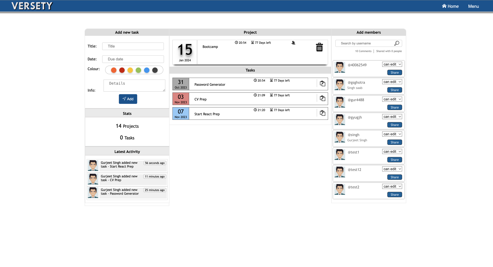

# Versety
Versety is a project and deadline management website originally conceived as a time management solution for university assignments and deadlines. The project's inception was driven by the need for a comprehensive tool to help students efficiently manage their academic commitments and reminders in their Emails.

## Table of Contents

- [Features](#features)
- [Getting Started](#getting-started)
- [Designs](#screenshots)
  - [System Requirements](#getting-started)
  - [Installation](#installation)
- [Usage](#usage)
- [License](#license)
- [Contact](#contact)

## Features

List of key features:

- Project creation and management.
- Deadline tracking.
- Collaboration tools for teams.
- User-friendly interface.
- Customizable settings.

## ScreenShots

### Login Screen

### Home Scree

### List View Screen

### Project Screen

## Getting Started

  ## System-Requirements

Before you proceed with the installation of Versety, please ensure that your system meets the following requirements:

- **Web Server:** You must have Apache installed and configured on your system, capable of running PHP version 7. The project was developed using PHP 7, so ensure that your web server can handle this version.

- **Database:** Versety relies on MySQL for its database. Ensure that you have MySQL up and running on your server. 

- **Web Browser:** To access the Versety web interface, you need a modern web browser with JavaScript enabled.

### Installation

Follow these steps to get Versety up and running:

1. Download the code.
2. Ensure Apache and SQL are installed.
3. Ensure Text editor is installed to make neccessary changes.

### Usage

To use Versety, follow these steps:

1. Move the downloaded code into Server(Localhost) Files.
2. Ensure you add the required DB file on SQL Server. (Not available at the moment)
3. Access the site using Localhost and the directory name.
4. Signup to login

## Background

The project features a sophisticated login system, implemented using jQuery, that provides users with secure access to their personalised accounts. Versety was designed to be accessible to a broad audience, allowing anyone to sign up and utilise its platform.

## Project Status

The project is still active and running; Considering that PHP 7 is losing support, there is potential for this project to be modernized with technologies like React, which could significantly enhance its performance and usability.

## Development and Usage

Versety's development spanned from 2017 to 2019 and incorporated a diverse range of programming languages and technologies, including HTML, CSS, JavaScript, jQuery, PHP, and SQL.

The project was initiated to simplify the complex task of managing academic assignments and deadlines, and it evolved over time to accommodate the needs of its user base. Although the active development phase has concluded, the project remains operational, and there is potential for future improvements to enhance its functionality and user experience.

During its active usage period, Versety served the needs of approximately 30 students throughout the year. Continuous improvement and feature enhancements were key aspects of the project's development strategy. Regular feedback from users was instrumental in identifying and addressing issues, as well as adding new features to enhance the platform's utility.

## License

This project is licensed under the [MIT License](https://opensource.org/licenses/MIT).

## Contact

If you have any questions or suggestions, feel free to reach out to us at [gsgghotra@gmail.com](gsgghotra@gmail.com).